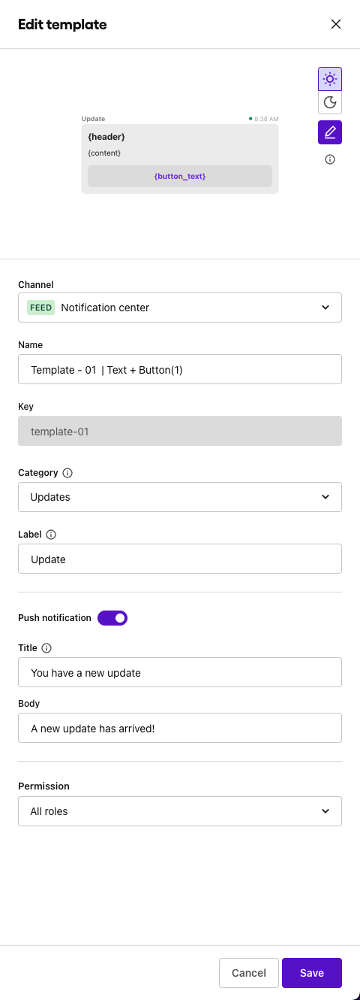
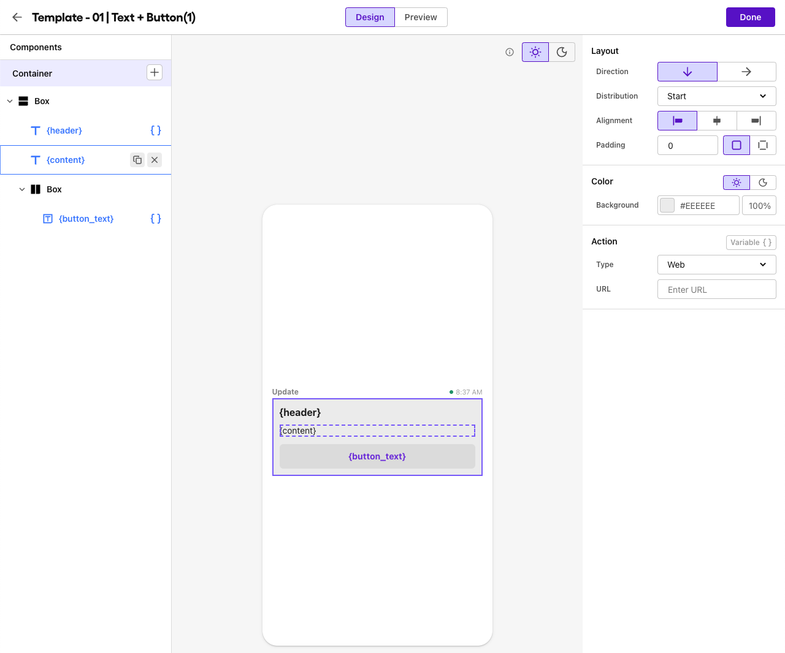
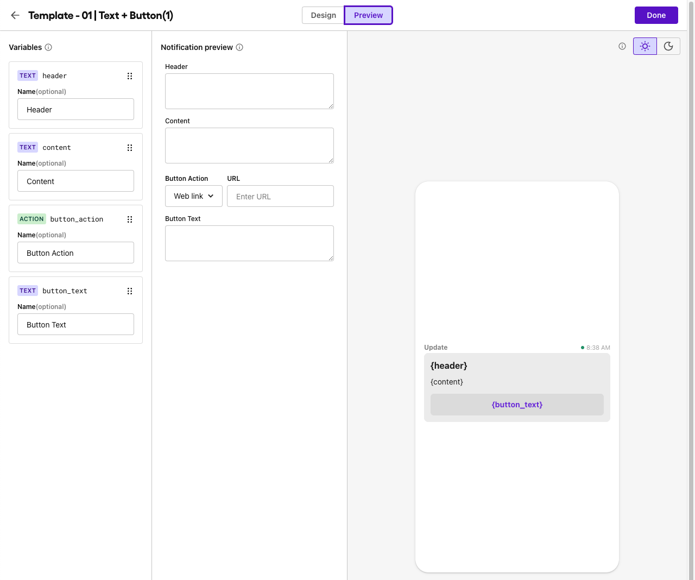

# Template 01

### Text with one button

key: `template-01`

**Required Variables**:

- header
- content
- button_action
- button_text

**Notes:** You can use any label, category and push template you desire.

