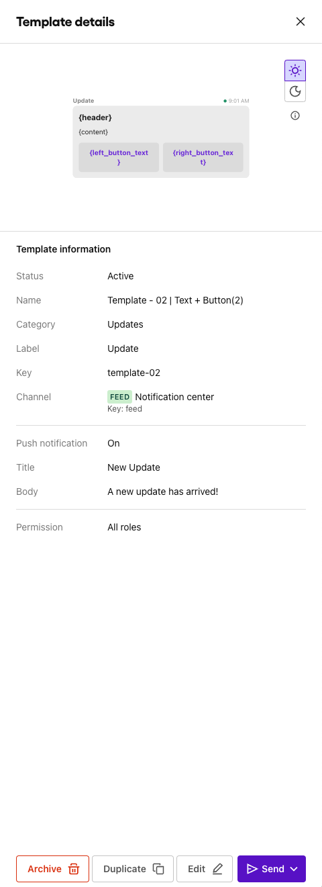
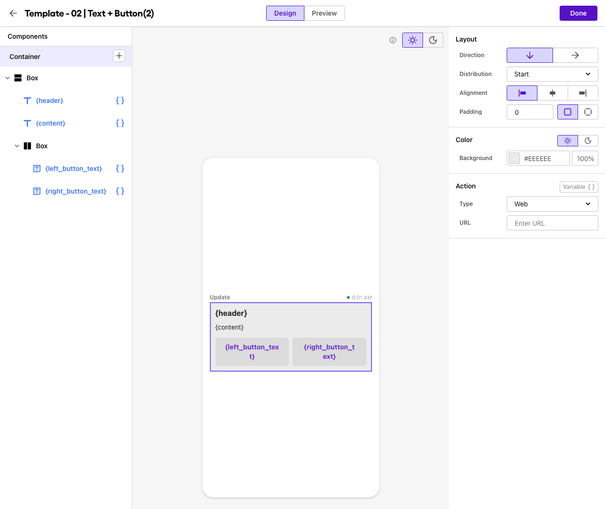
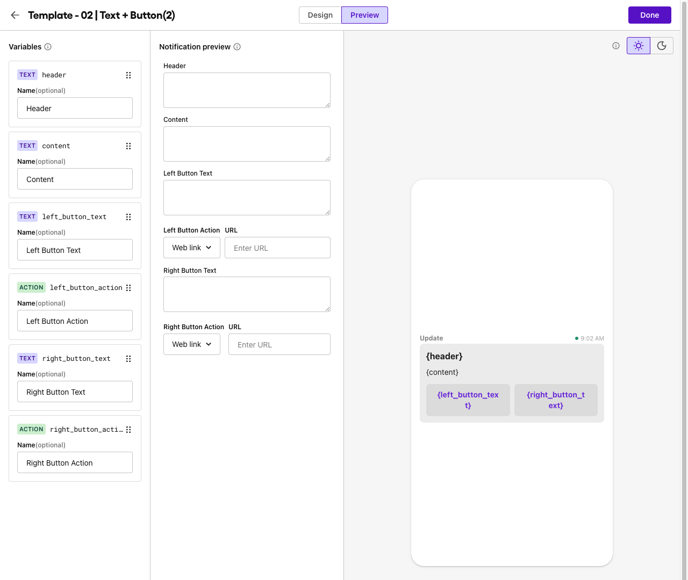

# Template 02

### Text with two buttons

key: `template-02`

**Required Variables**:

- header
- content
- left_button_text
- left_button_action
- right_button_text
- right_button_action

**Notes:** You can use any label, category and push template you desire.

